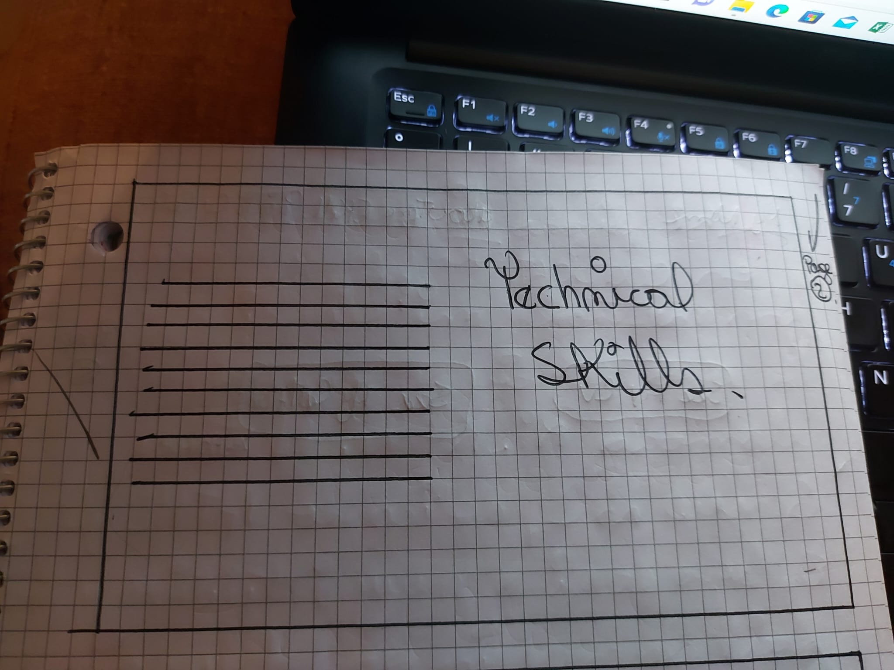
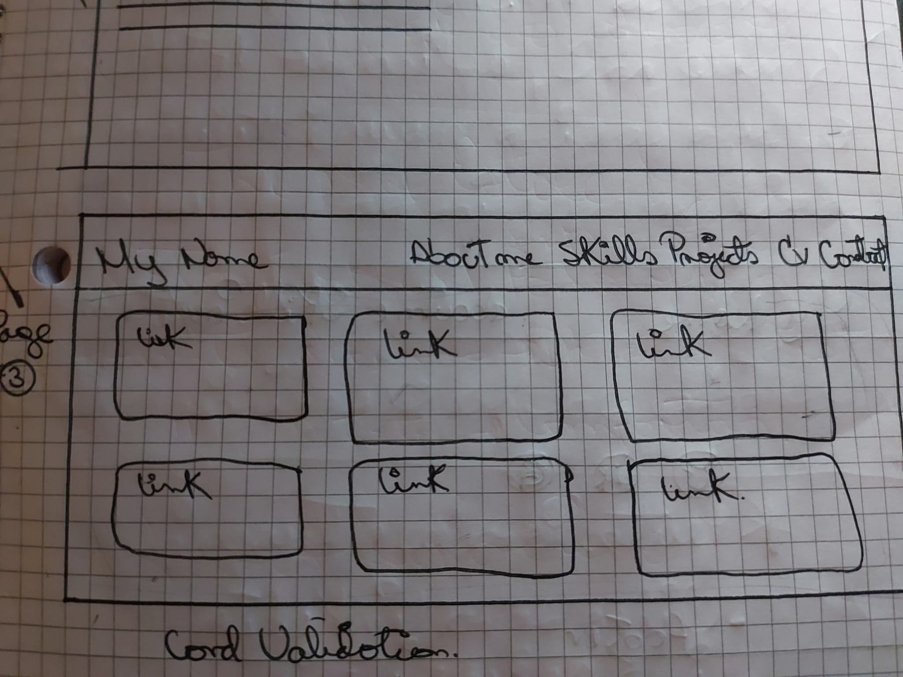
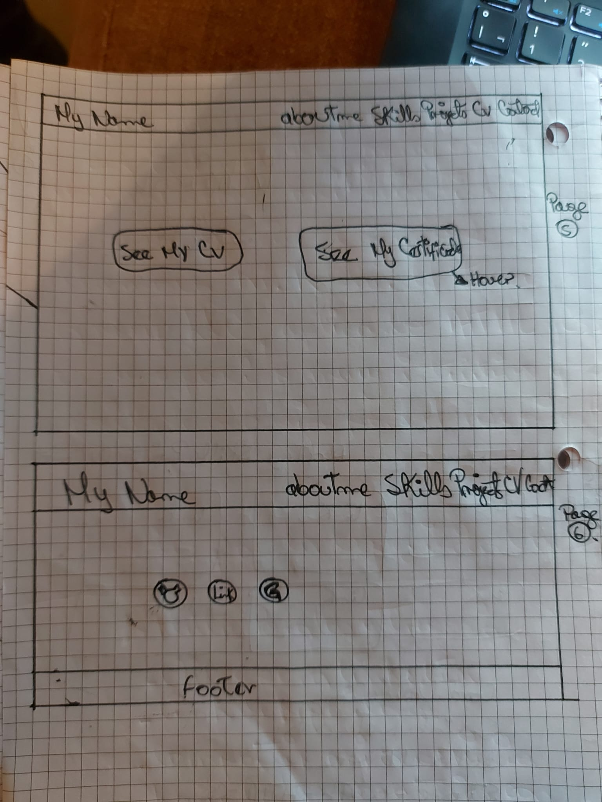

# My portfolio
### Description
 I have created this portfolio so that other people can see a little of my work, learn about me and be able to contact me.

### UX Design and Research
I wanted to make this portfolio with a modern and minimalist theme, without leaving behind intuitive usability.

#### Low fidelity design

####  High fidelity design. 

[1]: https://www.figma.com/file/HH4UQbHP4BPtjSO7ArKsuj/Untitled?type=design&node-id=0-1&mode=design&t=gt5URrXfV09nzrRS-0 "high fidelity design."

#### Criteria
Here we work with Html, CSS and JavaScript.
